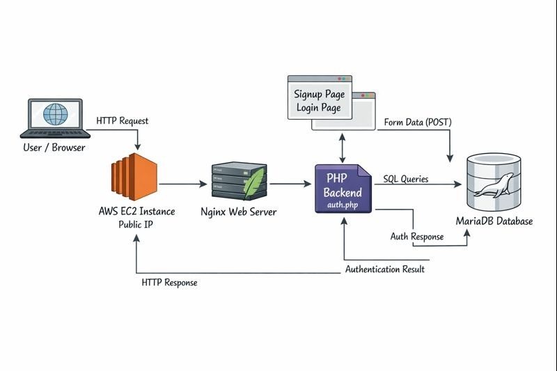
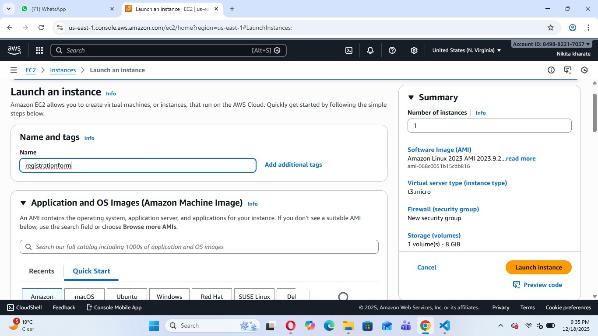
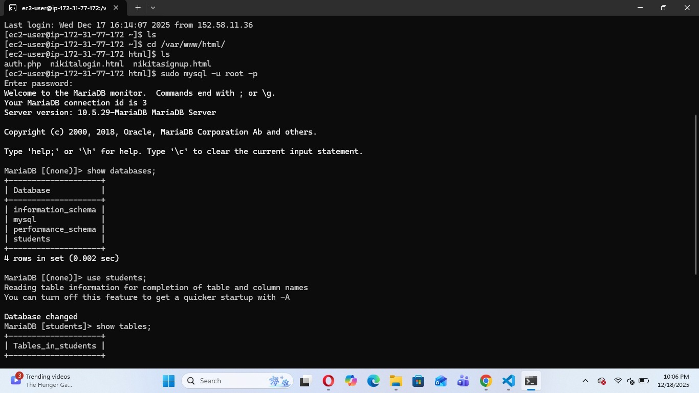
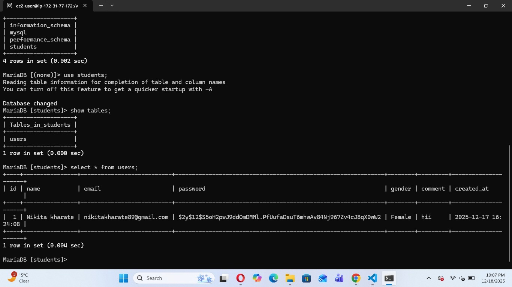
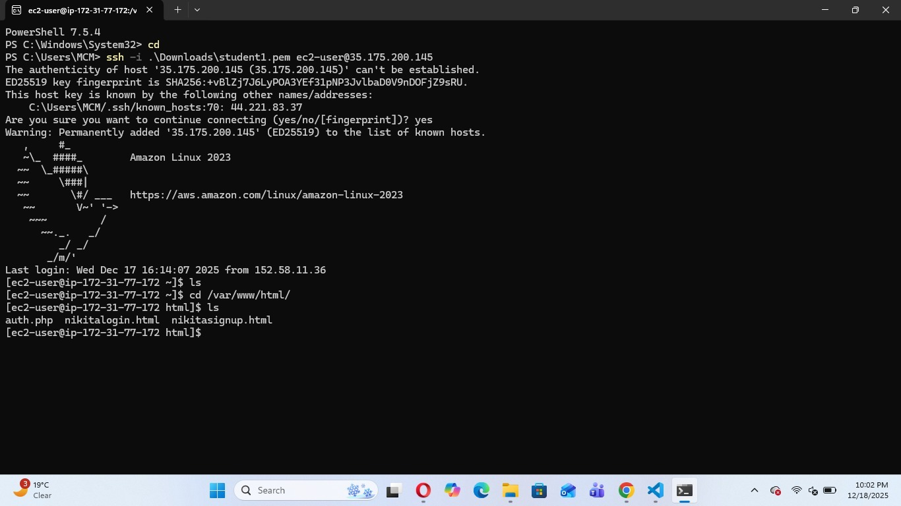
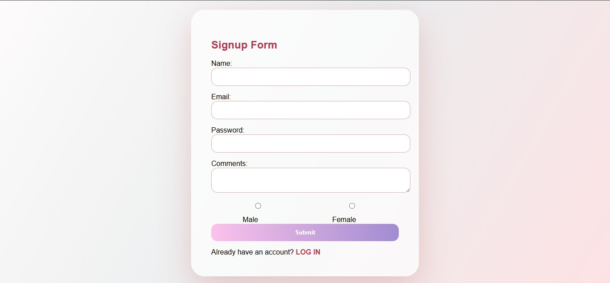

# Signup and Login Web Application Deployed on AWS EC2

## Introduction
This project demonstrates the deployment of a complete **Signup and Login web application** on an **AWS EC2 instance**. The application uses **Nginx** as a web server, **PHP** for backend authentication logic, and **MariaDB** as the database for storing user credentials. The main objective of this project is to understand how a full-stack web application can be hosted and managed on cloud infrastructure using AWS EC2.

The application allows users to register (signup) and log in securely through web forms. All components are installed and configured manually on a single EC2 instance to gain hands-on experience with cloud deployment.

---

## Project Architecture
- **User**: Accesses the application through a web browser
- **AWS EC2 Instance**: Hosts the entire application
- **Nginx**: Handles incoming HTTP requests
- **Backend Application (PHP)**: Processes signup and login logic
- **MariaDB**: Stores user data such as name, email, password, and gender

---

## Technologies Used
- AWS EC2
- Nginx
- PHP
- MariaDB
- HTML & CSS

---


## Step-by-Step Project Implementation

### Step 1: Launch AWS EC2 Instance
1. Create an EC2 instance using Amazon Linux or Ubuntu.
2. Configure security groups to allow:
   - HTTP (Port 80)
   - SSH (Port 22)
3. Connect to the instance using SSH.

---

### Step 2: Install and Configure Nginx
```bash
sudo apt update
sudo apt install nginx -y
sudo systemctl start nginx
sudo systemctl enable nginx
```
- Verify Nginx installation by accessing the EC2 public IP in a browser.

---

### Step 3: Install PHP and Required Modules
```bash
sudo apt install php php-mysql -y
```
- Configure Nginx to support PHP using PHP-FPM.
- Restart Nginx after configuration.

---

### Step 4: Install and Configure MariaDB
```bash
sudo apt install mariadb-server -y
sudo mysql_secure_installation
```
- Create a database and table for storing user information.
- Example fields: name, email, password, gender, comments.


---

### Step 5: Create Frontend Pages
- **Signup Page (`nikitasignup.html`)**
  - Collects user details such as name, email, password, gender, and comments.
- **Login Page (`nikitalogin.html`)**
  - Allows registered users to log in using email and password.

Both pages are styled using CSS and send form data to the backend PHP file.

---

### Step 6: Backend Authentication (`auth.php`)
- Handles both signup and login requests.
- Connects to MariaDB using PHP.
- Stores user data securely during signup.
- Validates user credentials during login.

---

### Step 7: Deploy Application on EC2
1. Place HTML and PHP files in `/var/www/html/`.
2. Set correct file permissions.
3. Restart Nginx:
```bash
sudo systemctl restart nginx
```
4. Access the application using the EC2 public IP address.

---

## Output
- Users can successfully sign up and store data in MariaDB.
- Registered users can log in using stored credentials.
- The application runs completely on an AWS EC2 instance.

---

## Conclusion
This project successfully demonstrates how to deploy a **Signup and Login web application on AWS EC2** using **Nginx, PHP, and MariaDB**. By hosting all components on an EC2 instance, the project provides practical experience in cloud computing, server configuration, and full-stack deployment.

The project highlights the power of AWS EC2 as a flexible and scalable cloud service and builds a strong foundation for deploying more advanced applications in real-world scenarios.


---


